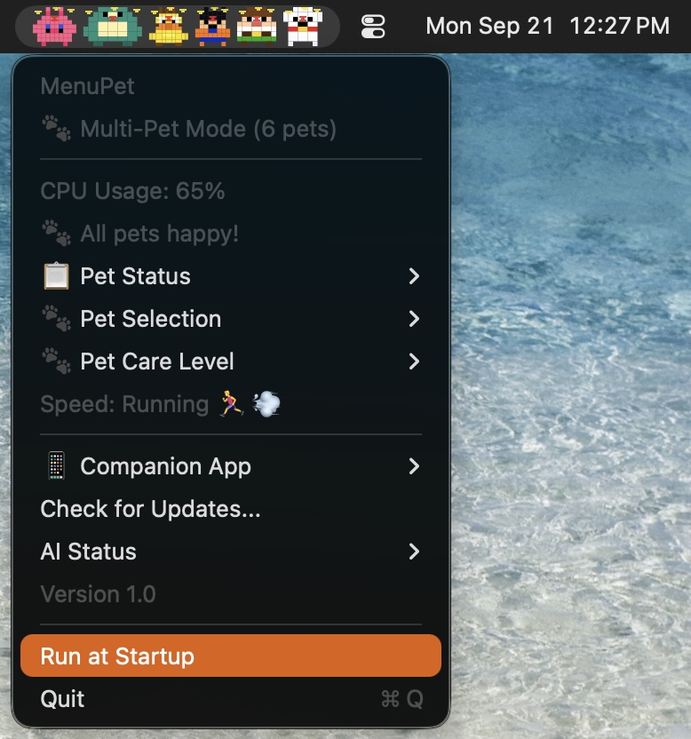

# MenuPet

A lightweight macOS menu bar app that displays animated pixel art sprites running across your menu bar. The animation speed is tied to your CPU usage — the harder your Mac works, the faster your pet runs.



## Features

- **120+ characters** across 21 categories — Pokémon, Mario, Zelda, Kirby, Dragon Ball, Naruto, Metal Slug, Contra, TMNT, Ghibli, Marvel, DC, Star Wars, Street Fighter, Mortal Kombat, Overwatch, Simpsons, Minions, Gundam, Labubu, King of the Hill, and Family Guy
- **CPU-reactive animation** — sprite speed adjusts based on system load
- **Random rotation** — automatically cycles to a random character every 10 minutes
- **Lightweight** — pure Swift, no dependencies, minimal resource usage
- **Menu bar only** — lives in your menu bar, no dock icon

## Download

**[Click here to download MenuPet.dmg](https://github.com/d8vela/MenuPet/releases/latest)** (macOS 13.0+)

1. Download the `.dmg` file from the latest release
2. Open the downloaded `MenuPet.dmg`
3. Drag **MenuPet.app** into your **Applications** folder
4. Open Terminal and run: `xattr -cr /Applications/MenuPet.app`
5. Open MenuPet from Applications

## Build from source

```bash
git clone https://github.com/d8vela/MenuPet.git
cd MenuPet
swift build -c release
cp .build/release/MenuPet /usr/local/bin/
```

## Usage

- Click the menu bar icon to see CPU usage, switch characters, or adjust settings
- Enable **Random Rotation** to cycle characters automatically
- Choose **Quit** to exit

## Character Categories

| Category | Characters |
|----------|------------|
| Pokémon | Pikachu, Jigglypuff, Snorlax, Charizard, Mew, Gengar, Bulbasaur, Squirtle, Eevee, Psyduck |
| Mario | Mario, Luigi, Peach, Bowser, Toad, Yoshi |
| Mario Kart | Mario, Luigi, Peach, Bowser, Toad, Yoshi, Donkey Kong |
| Zelda | Link, Zelda, Ganondorf, Epona, Navi |
| Kirby | Kirby, King Dedede, Meta Knight, Waddle Dee, Bandana Waddle Dee |
| Dragon Ball | Goku, Vegeta, Gohan, Frieza, Piccolo, Krillin |
| Metal Slug | Marco, Tarma, Eri, Fio, Morden, Camel, Slug Tank, Zombie, Mummy, Ape, Hermit, Crab |
| Contra | Bill, Lance |
| TMNT | Leonardo, Donatello, Raphael, Michelangelo |
| Ghibli | Totoro, No-Face, Kiki, Calcifer, Ponyo, Satsuki, Mei, Howl, Sophie, Append, Jiro, Chihiro |
| Marvel | Iron Man, Spider-Man, Captain America, Hulk, Thor, Deadpool, Black Panther, Doctor Strange, Thanos, Loki |
| DC | Wonder Woman, Batman, Superman, The Flash, Aquaman, Green Lantern |
| Star Wars | Luke, Vader, Yoda, Boba Fett, Chewbacca, R2-D2, C-3PO |
| Street Fighter | Ryu, Ken, Chun-Li, Guile, Dhalsim, Zangief, Blanka |
| Mortal Kombat | Scorpion, Sub-Zero, Liu Kang, Raiden, Johnny Cage, Sonya Blade, Jax |
| Overwatch | Tracer, Genji, D.Va, Winston, Mercy, Reinhardt |
| Simpsons | Homer, Bart, Marge, Lisa, Maggie |
| Minions | Kevin, Stuart, Bob |
| Gundam | RX-78-2, Char's Zaku, Wing Zero, Unicorn |
| Labubu | Labubu, Pink, Gray, Brown, White, Golden |
| King of the Hill | Hank Hill, Peggy, Bobby, Dale, Bill, Boomhauer, Luanne, Cotton, Kahn, Ladybird, John Redcorn, Buck Strickland |
| Family Guy | Peter Griffin, Lois, Stewie, Brian, Chris, Meg, Quagmire, Cleveland, Joe, Mayor Adam West, Herbert, Tom Tucker |

## Requirements

- macOS 13.0+
- Swift 5.9+

## License

MIT